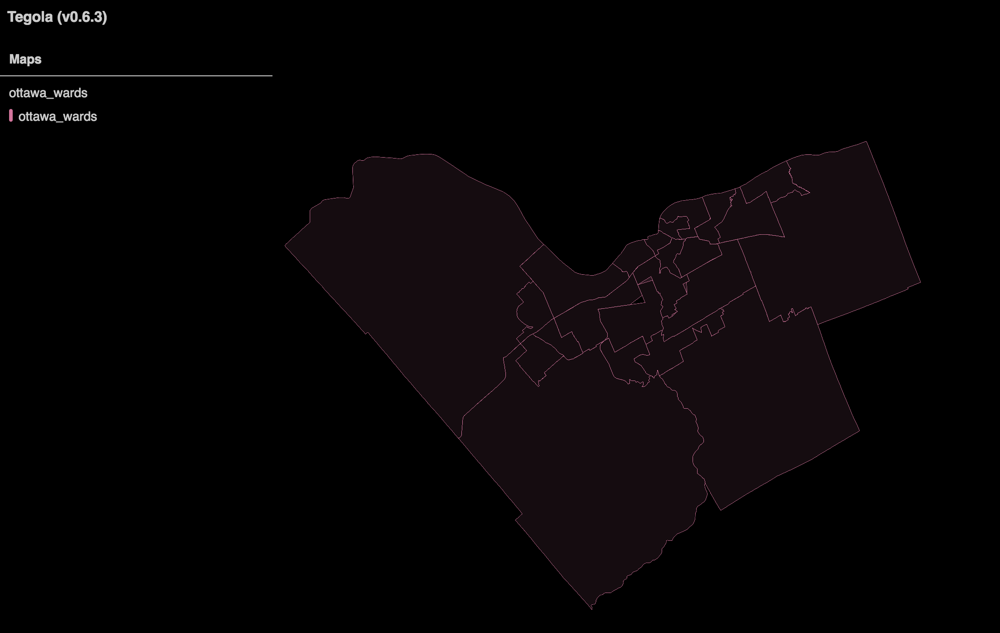
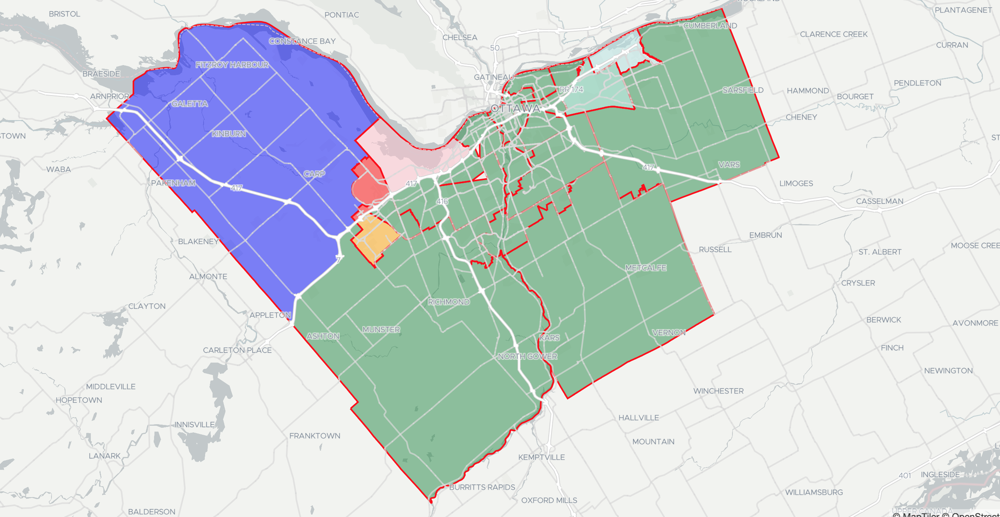

## Before we Start...

This is a tutorial. You're going to run into troubles.
If you try to do this, you might get angry,
and want to flip the table.

If you're feeling that way, start the timer.
Try to push through the snag _within 20 minutes_.
If you can't, try to reach out. You can do this of one of two ways:

- @ me in twitter, I'm [@brian_bancroft](https://twitter.com/brian_bancroft)
- @ me in slack. I'm in [The spatial community](https://thespatialcommunity.org)
  - go to #webdev, and @ me.
  - My handle is _@brian_

If you're going to try to do this, I'm here for you. I might not be there right away, but _I will get back to you_. We're going to make this work together.

---

# Intro

ArcGIS Server, Mapbox Studio, GeoServer, MapServer. These are all fantastic heavyweight contenders that help you serve layers of data, but what if you just wanted something that would serve a handful of Mapbox Vector Tiles (MVT) layers without all of the other million-and-one things they offer? Good news!

<iframe src="https://giphy.com/embed/3TvLcFwspzh5e" width="480" height="269" frameBorder="0" class="giphy-embed" allowFullScreen></iframe><p><a href="https://giphy.com/gifs/3TvLcFwspzh5e">via GIPHY</a></p>

_The open source world has you covered..._ There are currently at least three server applications which will let you do the think you want to do. Here, we're going to take use Tegola, a server application built on the Go language. This tutorial is build specifically for those who use Mac.

---

# Build it up locally

Before we can build something which we can deploy, first we need to build this. The following is how I build this from the ground up in a _local_ environment. By the end, we should have an environment where we can both build and test.

## Get the data

Before we can do anything, we _need_ a dataset. For the purposes of this tutorial, I've swindled a shapefile dataset provided kindly by the [_City of Ottawa_](http://data.ottawa.ca/dataset/wards-2014/resource/1b6112e5-3fe6-4976-8c8e-401a35d529a7). What we're going to do is we're going to take this data, and we're going to upload it into PostGIS. But before we go forward, you're going to need to download the following:

1.  My sql dump of said shapefile - [download](./ottawa_wards.sql)
2.  Postgres.app (at this point, this tutorial is for mac users) - [download](https://postgresapp.com/)
    - Postgres.app is the easiest way to use postgres on a mac in terms of config at the time of writing.
    - If you're using linux, [you probably already know how to get this going.](https://www.postgresql.org/download/linux)
    - If you're a windows user, I hear good things about PGAdmin..?

Once you have both items downloaded, we can move on to setting up the DB.

## Setting up the DB

Here, you're going to want to setup PostGIS, _then_ upload the data. This tutorial skips all the setup details of a Postgres database. Once you've figured all that out, you're going to want to start from the command line:

```sh
  $ > psql
```

Once in, you're going to want to create a new DB:

```sql
  CREATE DATABASE scratch;
```

Okay. If that works, we can exit...

```sql
  \q
```

...Only to go back in again...

```sh
  $ > psql scratch
```

Once in, you're going to want to create the postgis extension. This should work without any special installs on postgres.app and most other postgres installs:

```sql
  CREATE EXTENSION postgis;
```

If you see the following:

```sql
  CREATE EXTENSION
  Time: 1795.743 ms (00:01.796)
```

You're good to `\q` and get out of there.

Now it's just a matter of importing the data. Assuming you're in the same directory as the dump file you just downloaded, carry out the following:

```sh
  $ > psql scratch < ottawa_wards.sql
```

This should take a few seconds. Once done, you can check your records through your favorite GIS program (QGIS) or through psql. Running a length query like the following should yield about 23 rows:

```sql
  SELECT count(*) FROM "ottawa-wards";
```

At this point, your DB is set. Good job, time to move on...

## Get Tegola

In order to run a MVT server like Tegola, you need to [download](https://github.com/go-spatial/tegola/releases) the software first. Download it, and place the application in a folder. _Make sure it's in a folder you can easilly access through the command line!_

## Build a query

Now we have to build a query that will work for us. It needs to have an `id`, a `geometry` column, and some quantitative data and labels. To save time (to make up for the setup-fatigue you've probably just felt), I've built this query:

```sql
    SELECT
      ST_AsBinary(ST_Simplify(geo.geom, 0, false))
        AS wkb_geometry,
      geo.id
        AS id,
      "DESCRIPTIO"
        AS description,
      "WARD_NUM"::INTEGER
        AS ward_num,
      "NAME"
        AS numeric_name,
      "WARD_EN"
        AS desc_name,
      "COUNCILLOR"
        AS councillor
    FROM "ottawa-wards"
      AS geo
```

From this table, we're selecting a subset of the columns. We're casting these columns under a grab-bag of aliases. This is so that we're able to access the data behind these variables just a little bit easier. Notice that we're also casting one of the variables as an integer. This is required if we want to use a text field in populating a dataviz tool for a JS-based mapping library for purposes such as choropleths.

Run this query. Make sure you're getting some data back. If you are, you can move forward.

---

# Setup Tegola

_If you want to skip reading this part, [grab this file](https://gist.github.com/brianbancroft/a7ab93363a3ce882818edb0729709995)_

If you're still here, this is good. We can now get on the fun stuff: Setting up the server! In the same directory which you have Tegola (make sure it's accessable by the command line), we're going to start a configuration file. Call it `config.toml`, and make it blank for now.

```
A side note: TOML is "Tom's Markup Language". Another file type
```

### A TOML Breakdown:

First, comes the `webserver` config. We want to configure the port:

```toml
[[webserver]]
port = ":8080"
```

This is the network port. If you're interested in learning more about it, you can check out [this explainer](https://www.bleepingcomputer.com/tutorials/tcp-and-udp-ports-explained/).

Next, we need to setup the list of `providers`

```toml
  [[providers]]
    name = "scratch"
    type = "postgis"
    host = "localhost"
    port = 5432
    database = "scratch"
    user = "brianbancroft"
    password = ""
    srid = 4326
```

Here, we have one provider: One for a PostGIS database. There are many other ways you can play with this. Be advised that you're going to have to _change the username_. Now that we have the db, let's go down to the _layers_ and _map_ levels:

```toml
  [[providers.layers]]
    name = "ottawa_wards"
    geometry_fieldname = "geom"
    id_fieldname = "id"
    # TODO: Same issue: Get the geometry dumbing down using the exponential function
    sql = """
      <The SQL Query goes here>
    """
```

```toml
  [[maps]]
  name = "ottawa_wards"
    [[maps.layers]]
    provider_layer = "scratch.ottawa_wards"
    min_zoom = 7
    max_zoom = 20
```

This is the bare-minimum you need to get a single layer displaying using Tegola. Now that you see the components, [grab the entire file here](https://gist.github.com/brianbancroft/a7ab93363a3ce882818edb07297099954), and replace the username with your DB username. Now we're ready to start the _server!_

<iframe src="https://giphy.com/embed/13ByqbM0hgfN7y" width="480" height="480" frameBorder="0" class="giphy-embed" allowFullScreen></iframe><p><a href="https://giphy.com/gifs/dog-puppy-corgi-13ByqbM0hgfN7y">via GIPHY</a></p>

We're ready to start the server now! In the mac environment, we carry out the following:

```sh
  SQL_DEBUG=EXECUTE_SQL ./tegola serve --config=config.toml
```

Once started, we want to test the connection. Open up Postman, curl, and try to connect with the following site:

```
  http://localhost:8080/#8.79/45.2737/-75.7117
```

In a browser, you should see the following:



We have a working server now, but it's never enough just to have a server. We also need a client. For the next part, let's quickly build a map!

## Use a service that takes advantage of it

Okay. This is a Tegola tutorial, but we should build a client that makes use of the server. We're going to use MapboxGL as it is my personal fav as far as JS-based mapping libraries. For now, you don't need to change anything here, but these are things which you're going to want to know for when we swap to deploying this live on AWS:

The repo for the simple client is [here](https://github.com/brianbancroft/tegola-mvt-client). If you want to download it directly, carry out the following:

```sh
  $ git clone https://github.com/brianbancroft/tegola-mvt-client
```

Have a look at the index.js if you get a moment. I'm going to show just a couple of things:

1.  How to use a third-party basemap provider
2.  How to use your tegola layer

### Third-party basemap provider

If you look at lines 3-8 of `index.js`, you'll find the following block:

```js
const map = new mapboxgl.Map({
  container: 'map',
  style: 'https://openmaptiles.github.io/positron-gl-style/style-cdn.json',
  center: [-75.659, 45.3971],
  zoom: 9,
})
```

You can set your style here to a json file. These files are usually crunched through applications such as [`Maputnik`](https://maputnik.github.io/)

### Tegola Source

Between lines 14-18 (and line 11), you can see the following:

```js
  const instance = 'http://localhost:8080'

  (...)

  map.addSource('tracts', {
    type: 'vector',
    tiles: [`${instance}/maps/ottawa_wards/{z}/{x}/{y}.vector.pbf?`],
    tolerance: 0
  });
```

This is where we're setting up what goes to tegola. The _x_ and _y_ coordinates dictate the centre of the view, and the _z_ indicates the zoom-level.

We're going to leave off here. At this point, we've built a local MVT server using Tegola, and we're using Mapbox GL as a library to consume that data. Part two will be about hosting all of this on AWS.

---

# Tie this together!

With the server running on one end, start the client.

- Download it.
- Spin up the webserver:
  - `npm install`
  - `npm run start`

Go to [](http://localhost:3000). You should see the following:



**Boom**! We have a working MVT Server using Tegola, PostGIS and Mapbox GL JS. This will be the end of part 1.

For part 2, we will talk about the following:

- AWS, what is it?
- S3/route 53/RDS/EC2 and how to set it all up...
- Getting all this stuff on EC2

_Stay tuned..._

<iframe src="https://giphy.com/embed/SAmtv8Ccw5Ous" width="480" height="364" frameBorder="0" class="giphy-embed" allowFullScreen></iframe><p><a href="https://giphy.com/gifs/glitch-vhs-SAmtv8Ccw5Ous">via GIPHY</a></p>
