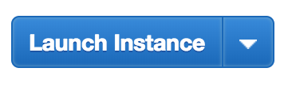

### Before we start,

If you want to run with this tutorial hands-on, you should spend a bit of time with [Part 1](../mvt-server-1). This will give you enough background to get started with part 2. _Plus you get to learn how to build your first MVT Server from scratch!_ What's not to love?

## Putting Tegola Online using AWS

In the last article, we learned how to build a _Mapbox Vector Tile_ (MVT) server using Tegola. But in order to move to greatness, we need to be able to take this from your local machine and up on a server. A big problem, right?

Well. Not for a few years, thanks to the the power of *The Cloud*™️. As of 2018, we have no shortage of competing services that want to sell you their servers, and have been built to get your servers to you as easilly as possible. And we will be using the Cloud, specifically Amazon's offering: _Amazon Web Services_ (AWS). In the AWS portal, we will be using the following services in this tutorial:

- EC2 (A Server)
- RDS (A Database service)
- S3 (Static file hosting, which we can use for website hosting as well!)

A note: In going forward, you're going to need an AWS account, and a credit card. This _will_ cost about $30/mo if you keep it running continuously.

## Build the Database

First, we're going to need to go back to the SQL Dump I've created for part 1. Make sure you still have that.

### Find RDS Service and Choose your Database

From inside the [AWS Console](https://console.aws.amazon.com), type 'rds' in the searchbar at the top of the page. You should see the following:


Go into RDS from there. At this time, we're not going to launch an aurora instance. That will be a bit too expensive for our purposes, but is really useful for databases in production for companies with budgets. Instead, scroll down until you find a button that says "Create Database". Click it.


You should see a selection page that includes a selection of DB instances which you can use to create a new DB. Select our [databae](https://www.redbubble.com/people/georube/works/25969139-postgres-before-all-others?p=t-shirt), (Postgres), and click on the "Next" button at the bottom of the page. Next, our use-case is Dev/Testing.

### Select Instance Specifications

If you're still here, good on you. There's a lot of things we have to walk through in this portion, and the next. But this is a marketable skillset, if this is your first go. Keep it up!

For testing, we're going to want to use to the Free tier. Selecting the box that gives us this option will take care of most of the options.

Under settings, select the following:

```
 DB Instance Identifier: tegola-test
 Master Username: tegola
 Master Password: <You know the drill here...>
```

On the next pane, follow these settings:


Once you've followed these settings, _create that database_. It's a button at the bottom, again. It will take a few seconds, but once it's up, you might have created your first database on AWS. Next, we're going to tackle the security policy in order to expose it for use by the app as well as the command line...

### Security Policy

Here, we're going to expose the database so that it can be accessed by all types of apps.

To gain access to the security settings, go to the "Security Groups" section (usually in the second column from the left), and click on the first link you see. In the image below, it's labelled as "rds-launch-wizard-3":


Once you're in, you're going to also be hit with information overload. Don't worry, this tutorial still has you covered! In the table, click on the only row. In the lower section of the page, click on the "Inbound" tab. You should see the following:


At this point, click "Edit", and "Add Rule". For type, select "PostgreSQL". For the drop-down under source, select "Anywhere". Click save. Now any IP can access this database.

> Note: This is not something you want to do for production databases or servers.
> There, you want to be more particular about what you want to let in and out
> but because this is a tutorial about "build-your-first-...", it's better not
> to over-complicate something that's already information-overload...

You can close the EC2 instance tab, as we won't need it going forward in this section. Next, let's put some stuff into the database!

### Populating the Database

Okay, now that we've set up the database, we're going to want to tunnel into the database, but we're going to need the following:

- The database endpoint
- The username (tegola)
- The database name
- The password

```sh
$ > psql \
    -h <DATABASE DNS ADDRESS> \
    -p 5432 -U <USERNAME> <DATABASE_NAME>
```

You'll be asked to enter the password. Do the thing.

Once in, the first thing you want to do is to create the postgis extension, again:

```sql
# CREATE EXTENSION postgis;
```

You should see a similar response as you did in part 1. Once that's done, exit (`\q`), so that we can import the sql dump data into this database:

```sh
$ > psql \
    -h <DATABASE DNS ADDRESS> \
    -p 5432 -U <USERNAME> <DATABASE_NAME> \
    < ottawa_wards.sql
```

Like in part 1, you've added the Ottawa Wards table to the database. To test, go back into the database, and run the following command:

```sql
  SELECT count(*) FROM "ottawa-wards";
```

If you have a number of wards, then you're in good company. With any luck, you've made your first DB using AWS RDS, you've added some data, and now you're ready to build the server (EC2) instance.

<iframe src="https://giphy.com/embed/Sk3KytuxDQJQ4" width="480" height="480" frameBorder="0" class="giphy-embed" allowFullScreen></iframe><p><a href="https://giphy.com/gifs/Sk3KytuxDQJQ4">via GIPHY</a></p>

## Build the Server
Alright. This might be the first crack you're having at building an EC2 instance. If it is, prepare to learn!


### Start an EC2 Instance
The first start is from [your AWS console](https://console.aws.amazon.com). Type in 'EC2' in the searchbar and go to the EC2 landing page. Look for the "Launch Instance" button. Click it...



After clicking, select the folloiwng:
- Amazon Linux. It's free and it's optimized for AWS
- Go for the micro, medium or large instance depending on your budget.
    - Click on "Configure Details"
- Accept the defaults and cycle to "Configure Security Group"
- Add rules. In the dropdowns, select "HTTP" and "HTTPS".

That's the start. You've created an EC2 Instance. Next comes the tunneling, then the installing. Be sure to copy down the DNS address and keep that somewhere handy. You're going to need it!

### Tunnel into the instance

This is going to be configuration, and instruction-reading. Here, I can't help you better than the official docs. [Read them](https://docs.aws.amazon.com/AWSEC2/latest/UserGuide/AccessingInstancesLinux.html), chose how you want to tunnel in using a PEM document, you're ready to move forward. Godspeed!

### Install wget and tmux

To carry on, we're going to want to install two command-line apps: `wget` and `tmux`. One allows us to download things from the internet and the other one allows applications to run while detatched. Installing both are as easy as the following in the command line:

```sh
$ sudo yum wget
```

```sh
$ sudo yum tmux
```

### Download tegola

Using `wget`, you can download various items from the internet using the command line. One of these things is Tegola!

```
wget  https://github.com/go-spatial/tegola/releases/download/v0.7.0/tegola_linux_amd64_cgo.zip
```

Now, it's a matter of unzipping. Rename the executable as `tegola` and then you'll be ready to configure the config file:


### Build the same config file using Vim

If this is your first time going into Vim, don't panic

<iframe src="https://giphy.com/embed/An4MkAbxeiyqY" width="480" height="245" frameBorder="0" class="giphy-embed" allowFullScreen></iframe><p><a href="https://giphy.com/gifs/panic-harry-potter-dont-An4MkAbxeiyqY">via GIPHY</a></p>

We're going to get you in, we're going to show you how to create a file, how to paste everything, and how to get out. There will be no sorrow here.

First, from your text editor,

- First change the first line in the `config.toml` file to port :`80`
- Then copy the entire `config.toml` file.

In the tegola directory, run the following command:

```sh
$ vim config.toml
```

Once in, press `i`, then paste everything using the `cmd+v` shortcut. Once that's done, we're going to press `esc` to exit into the observation mode, then `:`, `w`, `q` sequentially to save and exit (also known as "write-out"). If this is your first time, congrats: You've just got out of Vim.

### Run it

At this point, we're ready to run Tegola from EC2. First, you're going to want to get into tmux:

```sh
$ tmux
```

Once you're in tmux, go to the `tegola` directory, and run the Tegola app in a similar manner you did in part 1:

```sh
$ sudo ./tegola serve --config=config.toml
```

You're app should be running at this point, and you're ready to test it out! Try testing it over http using the same endpoints as you would over the browser in part 1. You should see the same familiar tiles.

## Take it one step further!

Instead of having your server point to the tegola server on localhost, try doing it with the public DNS address of the instance you built. If you see tiles, you've won and you have made your own tegola server. Congratulations!

## What's next?

- Attaching to domains
- Caching
- Serving over HTTPS

Once you have all three, you then have your own single-purpose MVT server on AWS, ready and "free" to be used by the team. In the next part, I will talk about caching over S3 and Reddis. Enjoy!

<iframe src="https://giphy.com/embed/bsbWrS0aqbS0w" width="480" height="480" frameBorder="0" class="giphy-embed" allowFullScreen></iframe><p><a href="https://giphy.com/gifs/illustration-space-women-bsbWrS0aqbS0w">via GIPHY</a></p>


